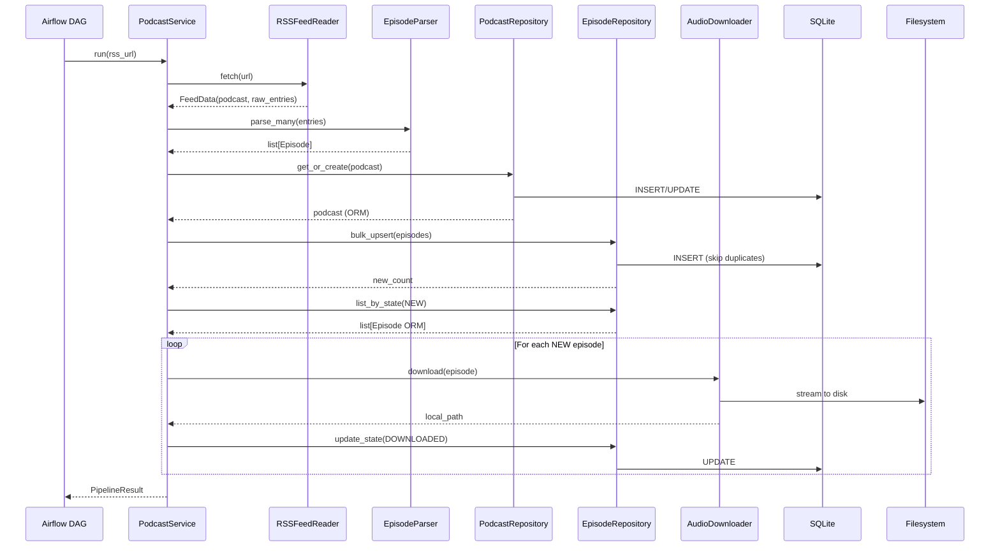

# PodFlow Architecture

> **Document version:** 1.0 — Phase 2 completion
> **Last updated:** 2026-07-10

## Overview

PodFlow is a podcast ingestion pipeline built on Apache Airflow. The architecture follows a strict layered design where business logic lives entirely within the `podflow` Python package and Airflow acts solely as an orchestrator.

The system ingests podcast RSS feeds, extracts episode metadata, persists it to a SQLite database, and downloads audio files — tracking each episode's progress through a processing state machine from discovery to completion.

---

## Layered Architecture

```
┌─────────────────────────────────────────────────────────┐
│                  ORCHESTRATION LAYER                     │
│  airflow/                                               │
│  Thin DAG definition — zero business logic              │
└────────────────────────┬────────────────────────────────┘
                         │  imports
┌────────────────────────▼────────────────────────────────┐
│                   SERVICE LAYER                          │
│  services/                                              │
│  Orchestration logic — wires components together        │
│  PodcastService.run() — single entry point              │
└────────────────────────┬────────────────────────────────┘
                         │  depends on
          ┌──────────────┼──────────────────┐
          │              │                  │
┌─────────▼─────┐ ┌──────▼──────┐ ┌───────▼──────────┐
│  INGESTION    │ │  DOWNLOADER │ │  DATABASE         │
│  rss_reader   │ │  audio.py   │ │  models.py        │
│  episode_     │ │  file-      │ │  session.py       │
│    parser.py  │ │  system.py  │ │  repository.py    │
└───────┬───────┘ └──────┬──────┘ └───────┬──────────┘
        │                │                │
        └────────────────┼────────────────┘
                         │  depends on
┌────────────────────────▼────────────────────────────────┐
│                    DOMAIN LAYER                           │
│  Pure data objects — zero framework dependencies         │
│  Podcast, Episode, PipelineResult, ProcessingState,      │
│  SourceType                                             │
└─────────────────────────────────────────────────────────┘

┌─────────────────────────────────────────────────────────┐
│               CROSS-CUTTING CONCERNS                     │
│  config/       — pydantic-settings from .env            │
│  logging/      — structured logging                     │
│  exceptions/   — custom exception hierarchy             │
└─────────────────────────────────────────────────────────┘
```

### Layer dependency rules

- **Domain layer** depends on nothing.
- **Ingestion, Downloader, Database** depend on Domain.
- **Service layer** depends on Ingestion, Downloader, Database, and Domain.
- **Airflow layer** depends only on Service.
- **No layer depends upward.**

---

## Component Responsibilities

| Module | Responsibility | Key Classes |
|---|---|---|
| `domain/podcast.py` | Podcast value object + `SourceType` enum | `Podcast`, `SourceType` |
| `domain/episode.py` | Episode value object + pipeline result | `Episode`, `PipelineResult` |
| `domain/processing_state.py` | Episode lifecycle state machine | `ProcessingState` |
| `ingestion/rss_reader.py` | Fetch and parse RSS XML | `RSSFeedReader`, `FeedData` |
| `ingestion/episode_parser.py` | Convert raw RSS → `Episode` domain objects | `EpisodeParser` |
| `downloader/audio.py` | HTTP streaming audio downloads with retry | `AudioDownloader` |
| `downloader/filesystem.py` | Filesystem path management and safety | `FileManager` |
| `database/models.py` | SQLAlchemy ORM models | `Podcast`, `Episode` (ORM) |
| `database/session.py` | Engine, session factory, table creation | `SessionLocal`, `init_db()` |
| `database/repository.py` | Persistence abstraction layer | `PodcastRepository`, `EpisodeRepository` |
| `services/podcast_service.py` | End-to-end pipeline orchestration | `PodcastService` |
| `config/settings.py` | Typed configuration from `.env` | `Settings` |
| `logging/logger.py` | Structured logger factory | `get_logger()` |
| `exceptions/exceptions.py` | Typed exception hierarchy | `PodFlowError` and subclasses |

---

## Data Flow



---

## Domain Layer vs Database Layer

PodFlow maintains a strict separation between domain objects and database models:

| | Domain (`domain/`) | Database (`database/models.py`) |
|---|---|---|
| **File type** | Plain Python dataclass | SQLAlchemy ORM model |
| **Dependencies** | None | SQLAlchemy |
| **Purpose** | In-memory representation moving through the pipeline | Persistent row in SQLite |
| **Example** | `Episode(title, guid, audio_url, ...)` | `Episode(id, podcast_id, processing_state, ...)` |

**Why this separation exists:**

1. The ingestion/downloader code should never know about database columns like `processing_state` or `created_at`.
2. The database models can evolve (add columns, change types) without breaking pipeline logic.
3. Domain objects can be constructed in tests without a database.
4. Future ingestion sources (YouTube, Spotify) produce the same `Episode` domain object — the repository handles mapping to the ORM.

---

## Service Layer Philosophy

The service layer is the **composition root**. It does not contain business logic — it wires collaborators together and sequences their calls.

```python
# The service receives every collaborator via constructor injection
class PodcastService:
    def __init__(
        self,
        *,
        rss_reader: RSSFeedReader,
        episode_parser: EpisodeParser,
        audio_downloader: AudioDownloader,
        podcast_repo: PodcastRepository,
        episode_repo: EpisodeRepository,
    ) -> None: ...
```

**Principles:**

- **No new operators in the service.** All dependencies are injected.
- **No repository proliferation.** Only `PodcastRepository` and `EpisodeRepository` exist. Workflows that need more complex queries compose repository methods, rather than spawning new repository classes.
- **The service owns the session lifecycle.** The Airflow DAG creates the session, passes it to repositories, and commits/rolls back outside the service.

---

## Airflow's Role

Airflow is strictly an **orchestrator**:

- It owns **scheduling** (every 6 hours) and **retries** (DAG-level).
- It owns the **execution environment** (which Python venv, which machine).
- It does **not** contain any parsing, downloading, or database logic.

The current DAG (`podflow/airflow/podcast_pipeline.py`) is a single task that instantiates `PodcastService` with dependencies wired from `settings` and calls `.run()`.

Future DAGs will split this into separate Airflow tasks per processing stage (download → transcribe → summarize), each targeting episodes in a specific `ProcessingState`.

---

## Configuration Flow

```
.env file
    │
    ▼
podflow/config/settings.py
    │  pydantic-settings loads env vars
    │  Provides typed properties (database_url, download_path)
    ▼
Every module that needs config imports:
    from podflow.config.settings import settings
```

No module reads `.env` directly. No module uses `os.getenv()`. Configuration is centralized and typed.

---

## Error Handling Strategy

All PodFlow-specific exceptions inherit from `PodFlowError`:

```
PodFlowError
├── IngestionError
│   ├── RSSFetchError
│   └── RSSParseError
├── ParseError
│   ├── MissingFieldError
│   └── InvalidDataError
├── DownloadError
├── FilesystemError
└── DatabaseError
```

The service layer catches exceptions at appropriate boundaries — a single failed download transitions that episode to `FAILED` but does not abort the entire pipeline.

---

## Future Evolution

- **Async pipeline**: The current synchronous download loop will become a bottleneck at scale. The architecture supports replacing `AudioDownloader` with an async version without changing the service interface.
- **Multi-source ingestion**: YouTube, Spotify, and Apple Podcasts readers will emit the same `Episode` domain objects, requiring zero changes to the service or database layers.
- **API layer**: A FastAPI backend will import `PodcastService` and repository classes directly — no Airflow dependency.
- **Database migration**: SQLite will be replaced with PostgreSQL via Alembic migrations when multi-user or production deployment is needed.
- **Distributed execution**: With the state machine already in place, each processing stage can become an independent Airflow task or even a separate microservice.
