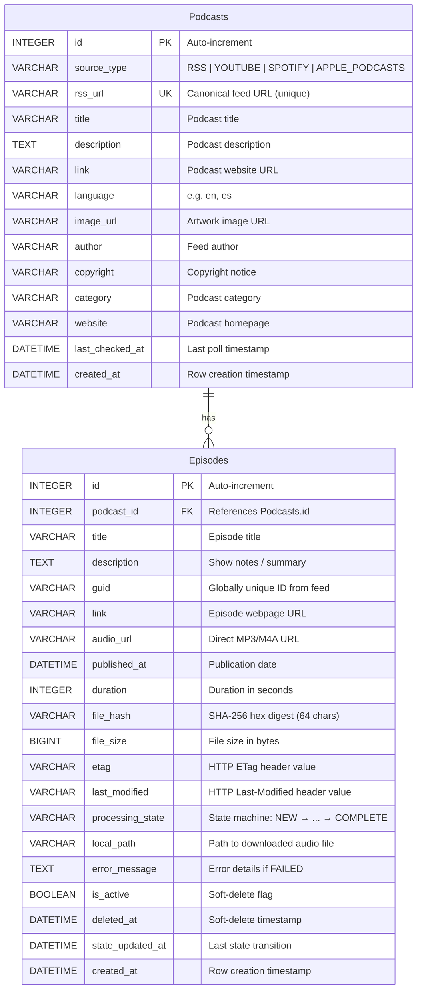

# PodFlow Database

> **Document version:** 1.0 — Phase 2 completion
> **Last updated:** 2026-07-10

## Overview

PodFlow uses **SQLite** via **SQLAlchemy ORM** for persistence. The database is a single file (`data/podflow.db`) auto-created on first use. All schema management is handled by `init_db()` in `session.py` — there are no manual migration scripts at this stage.

---

## Entity-Relationship Diagram



---

## Table: `podcasts`

One row per unique feed source. The `rss_url` column serves as the natural key — even though it's called `rss_url`, it can store YouTube channel URLs, Spotify show IDs, or any canonical source identifier.

| Column | Type | Constraints | Description |
|---|---|---|---|
| `id` | INTEGER | PK, auto-increment | Synthetic primary key |
| `source_type` | VARCHAR(20) | NOT NULL, INDEXED | Platform enum: `RSS`, `YOUTUBE`, `SPOTIFY`, `APPLE_PODCASTS` |
| `rss_url` | VARCHAR(1000) | NOT NULL, UNIQUE | Canonical feed/channel URL |
| `title` | VARCHAR(500) | NOT NULL | Podcast title from feed metadata |
| `description` | TEXT | NULLABLE | Podcast description / subtitle |
| `link` | VARCHAR(1000) | NULLABLE | Podcast website homepage |
| `language` | VARCHAR(50) | NULLABLE | ISO language code (e.g., `en`) |
| `image_url` | VARCHAR(1000) | NULLABLE | Artwork / cover image URL |
| `author` | VARCHAR(500) | NULLABLE | Podcast author/creator |
| `copyright` | VARCHAR(500) | NULLABLE | Copyright string from feed |
| `category` | VARCHAR(200) | NULLABLE | Podcast category |
| `website` | VARCHAR(1000) | NULLABLE | Podcast homepage URL |
| `last_checked_at` | DATETIME | NULLABLE | Set to `now()` on every `get_or_create` call |
| `created_at` | DATETIME | NOT NULL | Auto-set on row creation |

### Indexes

| Index | Columns | Purpose |
|---|---|---|
| `ix_podcasts_source_type` | `source_type` | Filter by platform |
| (implicit UNIQUE) | `rss_url` | Prevent duplicate feeds |

---

## Table: `episodes`

One row per episode. The combination `(podcast_id, guid)` is unique — this prevents re-inserting the same episode on subsequent pipeline runs. Soft-delete is implemented via `is_active` rather than row deletion.

| Column | Type | Constraints | Description |
|---|---|---|---|
| `id` | INTEGER | PK, auto-increment | Synthetic primary key |
| `podcast_id` | INTEGER | FK → podcasts.id, NOT NULL | Owning podcast |
| `title` | VARCHAR(500) | NOT NULL | Episode title |
| `description` | TEXT | NULLABLE | Show notes / episode summary |
| `guid` | VARCHAR(500) | NOT NULL | Globally unique ID from feed |
| `link` | VARCHAR(1000) | NULLABLE | Episode webpage URL |
| `audio_url` | VARCHAR(1000) | NULLABLE | Direct URL to audio file |
| `published_at` | DATETIME | NULLABLE | Publication timestamp |
| `duration` | INTEGER | NULLABLE | Duration in **seconds** |
| `file_hash` | VARCHAR(64) | NULLABLE | SHA-256 hex digest (future) |
| `file_size` | BIGINT | NULLABLE | File size in bytes (future) |
| `etag` | VARCHAR(500) | NULLABLE | HTTP ETag for conditional GET (future) |
| `last_modified` | VARCHAR(100) | NULLABLE | HTTP Last-Modified for conditional GET (future) |
| `processing_state` | VARCHAR(20) | NOT NULL, DEFAULT `NEW`, INDEXED | Current pipeline stage |
| `local_path` | VARCHAR(1000) | NULLABLE | Path to downloaded audio file |
| `error_message` | TEXT | NULLABLE | Error details (set when `FAILED`) |
| `is_active` | BOOLEAN | NOT NULL, DEFAULT `TRUE`, INDEXED | Soft-delete flag |
| `deleted_at` | DATETIME | NULLABLE | Soft-delete timestamp |
| `state_updated_at` | DATETIME | NULLABLE | Last state transition timestamp |
| `created_at` | DATETIME | NOT NULL | Auto-set on row creation |

### Constraints

| Constraint | Columns | Purpose |
|---|---|---|
| `uq_episode_guid_per_podcast` | `(podcast_id, guid)` | Prevent duplicate episodes within a podcast |
| FK | `podcast_id → podcasts.id` | Referential integrity |

### Indexes

| Index | Columns | Purpose |
|---|---|---|
| `ix_episodes_processing_state` | `processing_state` | Find episodes by pipeline stage |
| `ix_episodes_is_active` | `is_active` | Exclude soft-deleted rows efficiently |

---

## Processing State Values

The `processing_state` column stores one of these values, corresponding to `ProcessingState` enum members:

| Value | Meaning |
|---|---|
| `NEW` | Metadata persisted; no processing started |
| `DOWNLOADED` | Audio file on disk |
| `TRANSCRIBED` | Speech-to-text complete |
| `SUMMARIZED` | AI summary generated |
| `EMBEDDED` | Text embeddings computed |
| `INDEXED` | Searchable in vector/full-text index |
| `COMPLETE` | All stages finished |
| `FAILED` | Unrecoverable error |

Transitions are validated at the domain layer (`ProcessingState.transition_to()`) before the repository persists the change.

---

## Repository Layer

### Design principles

1. **Repositories are persistence abstractions** — business logic never writes raw SQL or SQLAlchemy queries.
2. **Minimal repository count** — only `PodcastRepository` and `EpisodeRepository` exist. Workflow-specific queries compose existing repository methods.
3. **Soft-delete awareness** — all queries on `EpisodeRepository` filter `is_active=True` by default. Deletion is always soft.
4. **Transition validation** — `update_state()` validates the state transition via the domain enum before persisting.

### PodcastRepository

| Method | Purpose |
|---|---|
| `get_or_create(rss_url, source_type, **fields)` | Idempotent podcast registration; bumps `last_checked_at` on existing rows |
| `get_by_id(podcast_id)` | Lookup by primary key |

### EpisodeRepository

| Method | Purpose |
|---|---|
| `bulk_upsert(podcast_id, episodes_data)` | Batch insert, skips existing GUIDs. Returns count of new rows |
| `list_by_state(state, podcast_id)` | Returns active episodes in a given `processing_state`, ordered by `published_at` |
| `update_state(episode_id, new_state, **kwargs)` | Transitions an episode to a new state with optional `local_path` or `error_message` |
| `soft_delete(episode_id)` | Sets `is_active=False` and `deleted_at=now()` |

---

## Session Management

The `SessionLocal` factory is created in `session.py` and is designed to be used as a context-managed generator:

```python
# In Airflow DAG or service caller:
session = SessionLocal()
try:
    repo = PodcastRepository(session)
    # ... operations ...
    session.commit()
except Exception:
    session.rollback()
    raise
finally:
    session.close()
```

The service layer does **not** commit or rollback — that responsibility belongs to the caller (Airflow DAG, CLI command, or test harness). This keeps the service testable and transaction-agnostic.

---

## Future Migration Strategy

Currently, `init_db()` calls `Base.metadata.create_all()` which is idempotent — it creates tables only if they don't exist. For production:

1. **Alembic** will be introduced for versioned schema migrations.
2. Migration scripts will live in `podflow/database/migrations/`.
3. `init_db()` will be replaced with `alembic upgrade head`.
4. The transition from SQLite to PostgreSQL will be a single connection string change, provided no SQLite-specific SQL is used (currently, only `check_same_thread` is SQLite-specific).

---

## Future Evolution

- **`file_hash` population**: The downloader will compute SHA-256 during streaming and store it alongside `local_path`.
- **`etag` / `last_modified` support**: Conditional HTTP GET to skip re-downloading unchanged files.
- **`duration` normalization**: Some feeds provide duration in non-standard formats. The parser will be extended as edge cases are discovered.
- **Full-text search**: A virtual FTS5 table in SQLite or a separate search index for episode content.
- **Audit logging**: A `state_transitions` audit table may be added to track every state change with timestamps for debugging.
