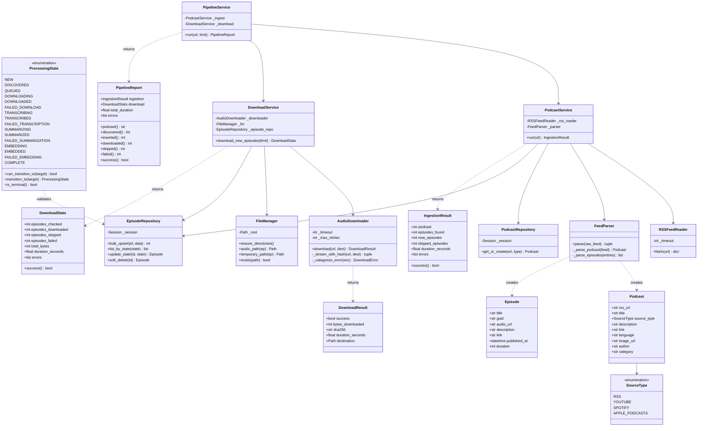
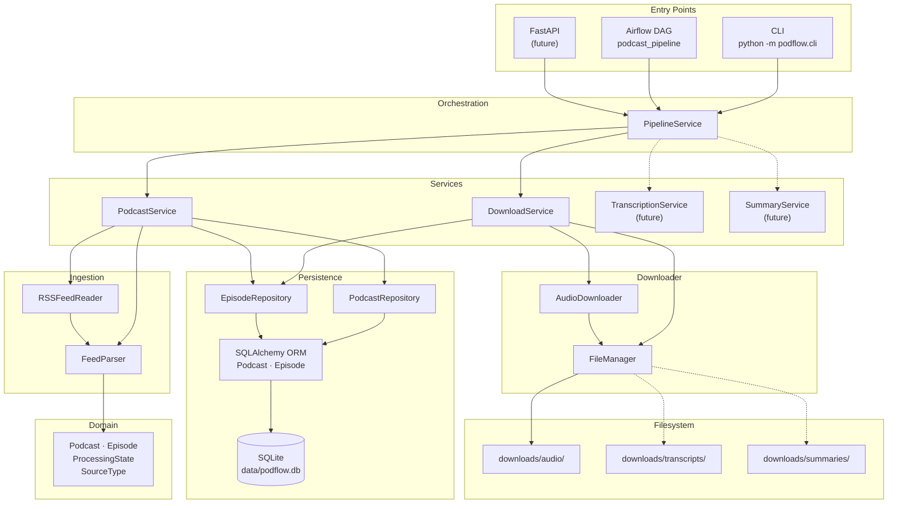
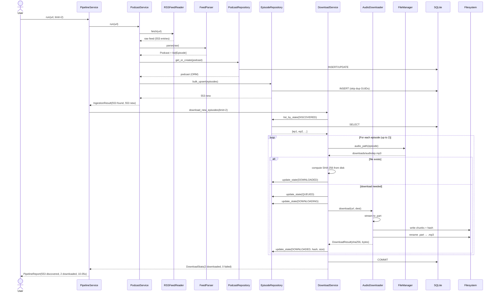
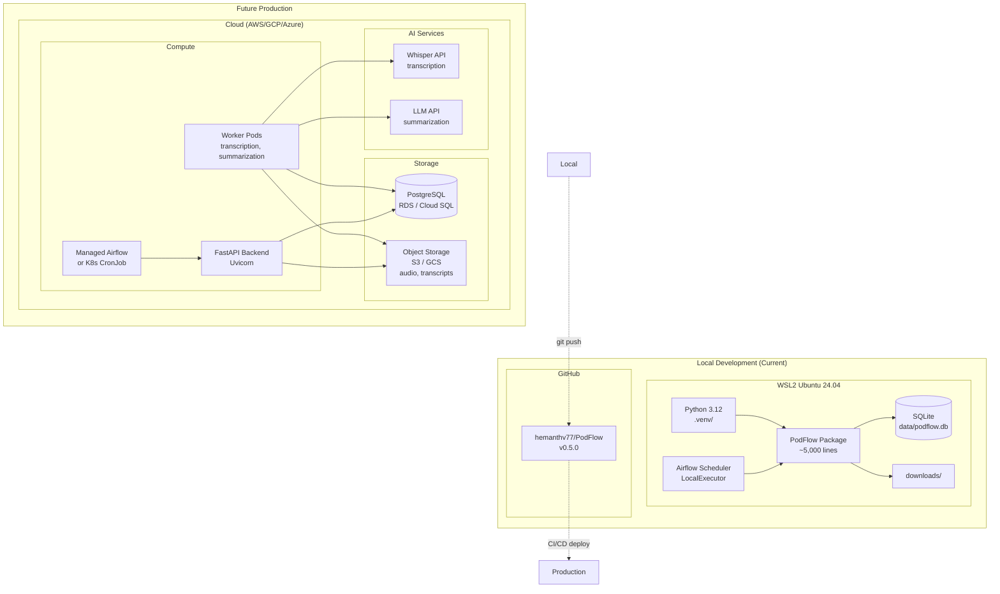
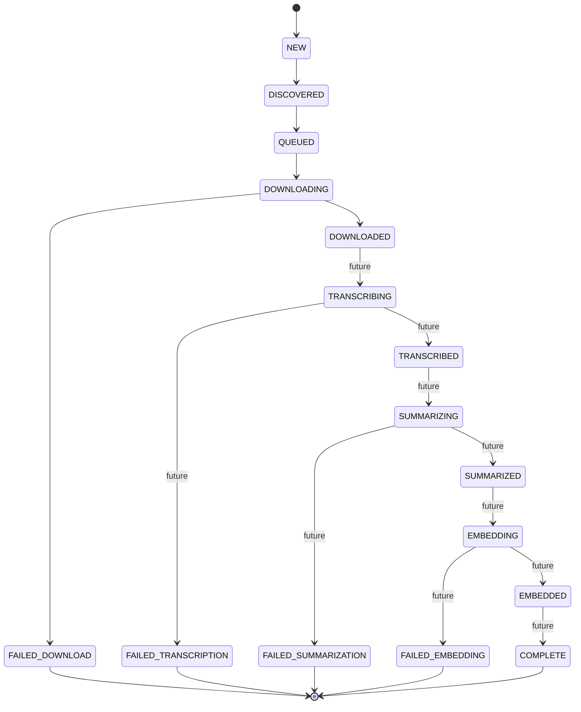

# PodFlow UML Diagrams — Version 1

> **Generated:** 2026-07-10
> **Source:** Mermaid (render in any Mermaid-compatible viewer)

---

## 1. Class Diagram — Domain & Services

---

## 2. Component Diagram — System Architecture

---

## 3. Sequence Diagram — Full Pipeline Execution

---

## 4. Deployment Diagram — Current & Future

---

## 5. State Machine Diagram — Episode Lifecycle

