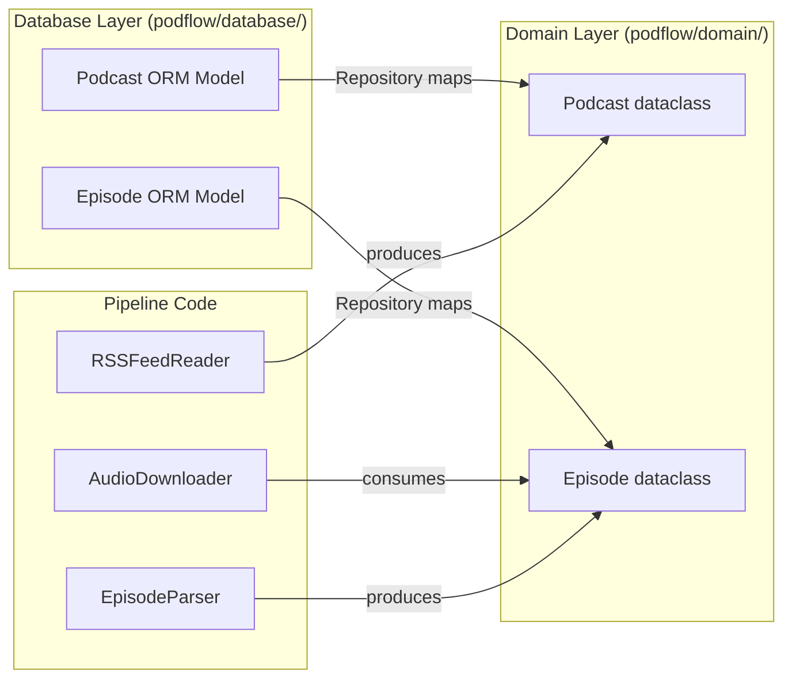
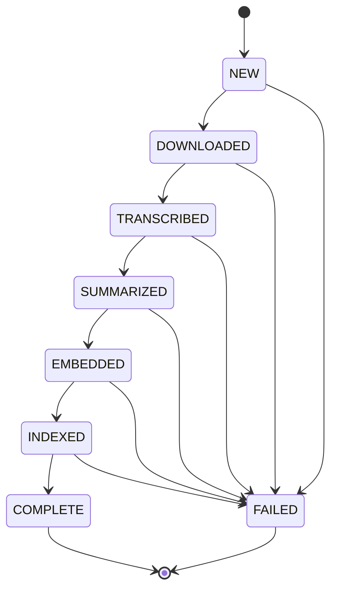

# PodFlow Domain Model

> **Document version:** 1.0 — Phase 2 completion
> **Last updated:** 2026-07-10

## Overview

The domain model consists of **pure Python objects** that represent the core concepts of the system: podcasts, episodes, processing states, and source types. These objects carry zero framework dependencies — no SQLAlchemy, no HTTP, no Airflow. This separation is the foundation of the architecture.

---

## Domain Objects vs ORM Models

PodFlow maintains two parallel type hierarchies for the same concepts:



**Why two representations exist:**

1. The ingestion code (`RSSFeedReader`) produces a `Podcast` dataclass — it has no concept of database IDs, `created_at`, or `processing_state`.
2. The downloader code (`AudioDownloader`) receives an `Episode` dataclass — it has no concept of `podcast_id` foreign keys or `is_active`.
3. The repository maps between them — it takes domain objects as input, translates them to ORM operations, and returns ORM objects that the service layer queries.

---

## Podcast (Domain)

```python
@dataclass
class Podcast:
    rss_url: str
    title: str
    source_type: SourceType = SourceType.RSS
    description: str | None = None
    link: str | None = None
    language: str | None = None
    image_url: str | None = None
    author: str | None = None
    copyright: str | None = None
    category: str | None = None
    website: str | None = None
```

A podcast is the **source of episodes** — an RSS feed, a YouTube channel, a Spotify show. The `rss_url` field is the canonical identifier even when the source is not RSS (it stores YouTube channel URLs, etc.).

### SourceType Enum

```python
class SourceType(str, Enum):
    RSS = "RSS"
    YOUTUBE = "YOUTUBE"
    SPOTIFY = "SPOTIFY"
    APPLE_PODCASTS = "APPLE_PODCASTS"
```

Each ingestion reader sets the appropriate `SourceType` when constructing a `Podcast`. Currently only `RSS` is implemented.

---

## Episode (Domain)

```python
@dataclass
class Episode:
    title: str
    guid: str
    audio_url: str | None = None
    description: str | None = None
    link: str | None = None
    published_at: datetime | None = None
    duration: int | None = None      # seconds
```

An episode is **content discovered from a feed**. It is the canonical intermediate representation that flows through the pipeline:

```
RSSFeedReader.fetch()
        │
        ▼
    FeedData (contains raw feedparser entries)
        │
        ▼
EpisodeParser.parse_many()
        │
        ▼
    list[Episode]   ← domain objects
        │
        ├──→ EpisodeRepository.bulk_upsert()  → SQLite
        └──→ AudioDownloader.download()       → disk
```

The domain `Episode` has **no persistence concerns** — no `id`, no `podcast_id`, no `processing_state`. Those are added by the ORM model and repository.

---

## PipelineResult

```python
@dataclass
class PipelineResult:
    podcast_title: str
    episodes_found: int
    episodes_new: int
    episodes_downloaded: int
    errors: list[str]
```

Returned by `PodcastService.run()` to provide observability into what happened during a pipeline run. The `success` property returns `True` if `errors` is empty.

---

## Processing State Machine



### States

| State | Reached When | Current Implementation |
|---|---|---|
| `NEW` | Episode metadata persisted | `bulk_upsert()` creates rows in this state |
| `DOWNLOADED` | Audio file written to disk | `update_state()` called after successful download |
| `TRANSCRIBED` | Speech-to-text complete | Not yet implemented |
| `SUMMARIZED` | AI summary generated | Not yet implemented |
| `EMBEDDED` | Text embeddings computed | Not yet implemented |
| `INDEXED` | Searchable in index | Not yet implemented |
| `COMPLETE` | All processing stages finished | Not yet reachable |
| `FAILED` | Unrecoverable error at any stage | Set on download failure |

### Transition Rules

The `ProcessingState` enum enforces valid transitions:

- **Linear progression required**: `NEW → DOWNLOADED → TRANSCRIBED → ... → COMPLETE`. Skipping stages raises `ValueError`.
- **FAILED is always valid**: Any state can transition to `FAILED`. This preserves partial progress.
- **Terminal states**: `COMPLETE` and `FAILED` reject further transitions.
- **FAILED is terminal**: Once failed, an episode cannot transition further without explicit intervention.

```python
>>> ProcessingState.NEW.can_transition_to(ProcessingState.DOWNLOADED)
True

>>> ProcessingState.NEW.can_transition_to(ProcessingState.INDEXED)
False  # would skip TRANSCRIBED, SUMMARIZED, EMBEDDED

>>> ProcessingState.NEW.can_transition_to(ProcessingState.FAILED)
True

>>> ProcessingState.COMPLETE.is_terminal
True
```

### What the state machine enables

1. **Resumability**: A failed download doesn't require re-fetching the feed or re-parsing metadata.
2. **Parallel processing**: Future DAGs can have separate tasks for each stage, each querying `WHERE processing_state = 'STAGE_N'`.
3. **Observability**: Query `GROUP BY processing_state` for a dashboard showing pipeline health.
4. **Selective retries**: Retry only `FAILED` episodes without re-running the entire pipeline.

---

## FeedData (Ingestion Intermediate)

```python
@dataclass
class FeedData:
    podcast: Podcast
    entries: list[dict[str, Any]]
```

An intermediary value object produced by `RSSFeedReader.fetch()` and consumed by `EpisodeParser.parse_many()`. It bridges the gap between raw RSS XML and structured domain objects. It is not persisted — it exists only in memory during a pipeline run.

---

## Relationship to ORM Models

The domain objects and ORM models represent the **same concepts at different layers**:

| Concept | Domain Layer | ORM Model | Key Difference |
|---|---|---|---|
| Podcast feed | `Podcast` dataclass | `Podcast` model | ORM adds `id`, `created_at`, `last_checked_at` |
| Episode | `Episode` dataclass | `Episode` model | ORM adds `podcast_id`, `processing_state`, `is_active`, file integrity columns |

The repository is the **mapping layer**:

- `PodcastRepository.get_or_create()` receives domain fields via `**kwargs` and maps them to ORM columns.
- `EpisodeRepository.bulk_upsert()` receives a list of dicts extracted from domain `Episode` objects.
- `EpisodeRepository.list_by_state()` returns ORM `Episode` rows — the service layer reads their fields and constructs lightweight domain `Episode` objects for the downloader.

---

## Future Evolution

- **Transcription domain objects**: A `Transcript` dataclass may be added when transcription is implemented — likely with a separate `transcriptions` table for the text content.
- **Summary domain objects**: An `EpisodeSummary` dataclass for AI-generated summaries.
- **Enriched episode metadata**: Fields like `explicit`, `season`, `episode_number` from RSS iTunes extensions.
- **Value objects for identifiers**: `PodcastId`, `EpisodeId` value objects (wrapping int) for type safety instead of raw integers.
- **Domain events**: For decoupled workflows (e.g., `EpisodeDownloaded` event triggers transcription), a lightweight event bus may be introduced.
